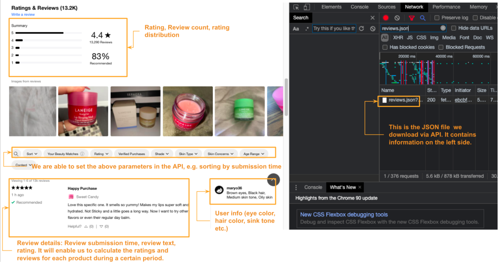
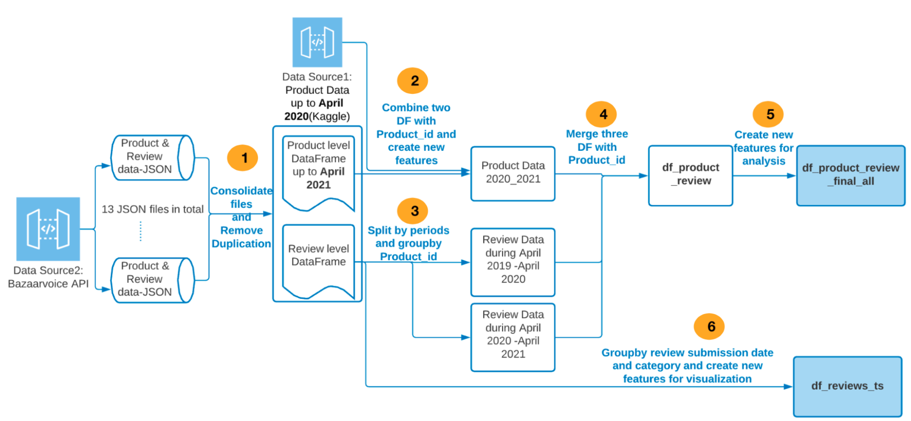
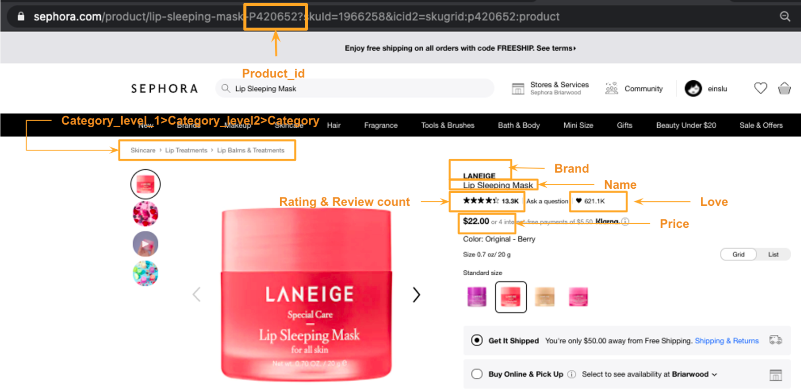
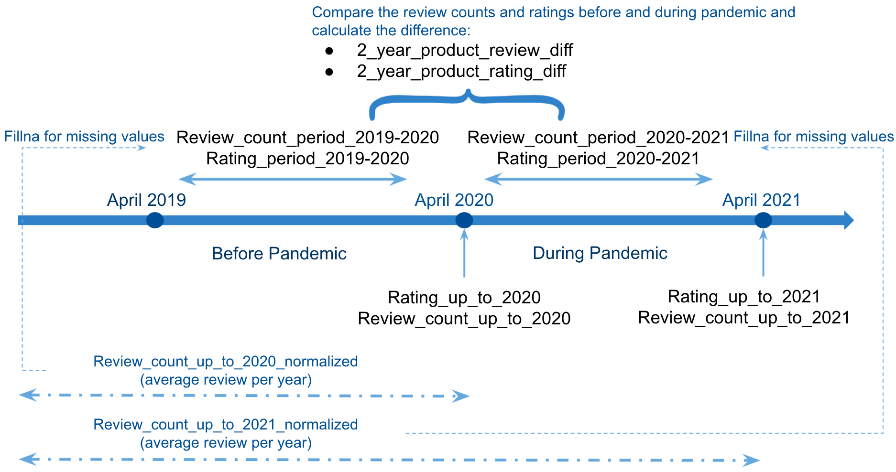
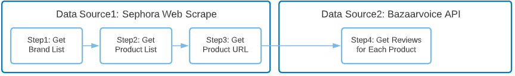
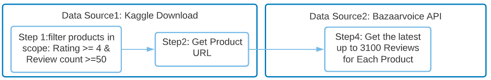

<!-- Output copied to clipboard! -->

>>>>>  gd2md-html alert:  ERRORs: 0; WARNINGs: 0; ALERTS: 6.

<ul style="color: red; font-weight: bold"><li>See top comment block for details on ERRORs and WARNINGs. <li>In the converted Markdown or HTML, search for inline alerts that start with >>>>>  gd2md-html alert:  for specific instances that need correction.</ul>

Links to alert messages:
<a href="#gdcalert1">alert1</a>
<a href="#gdcalert2">alert2</a>
<a href="#gdcalert3">alert3</a>
<a href="#gdcalert4">alert4</a>
<a href="#gdcalert5">alert5</a>
<a href="#gdcalert6">alert6</a>

>>>>> PLEASE check and correct alert issues and delete this message and the inline alerts.

**Sephora Review Analysis**

**Project for Milestone 1, SIADS 591&592**

**Motivation**

Since COVID-19 hit the world, the past year has changed consumers’ everyday routine and home experiences that ultimately impacted the way consumers interact with the beauty industry. According to COVID-19 Trends tracked by Spate NYC, Americans have been adapting to the new lifestyle as well as shifting their consumer behavior and demand. Some shifts are temporary, but some come with a lasting impact on consumers’ daily routine and mentality, which will change the way they engaged with different beauty categories. While it still takes time to go back to normal in the US, Spate mentioned that consumers are adapted to new routines at home, indicating shifts among the main categories that could bring happiness at home during the epidemic.

Sephora, the leader in prestige beauty Omni-retail with a roughly 80% of US market share, operates 2,021 stores in 35 countries worldwide, with an expanding base of over 500 stores across the Americas. Owned by LVMH, the world’s leading luxury goods group, Sephora US reached approximately 1.3 billion dollars of sales volume in 2020. According to the latest financial report, Sephora occupies 97% (2021 out of 2072) stores under the segment of selective retailing and expanded 64 branches globally in 2020. However, because the traffic in stores can easily create a health crisis, Sephora closed more than 90% of stores worldwide for almost two months and responded to the unprecedented success of online sales. Even though stores were gradually reopened from May to the end of June with special attention, the whole segment of selective retailing still went down more than 30%. This demonstrated the resilience of omnichannel strategy during the global health crisis and the substantial negative impact of the epidemic on the beauty industry.

Our proposed project is motivated by our interest in the beauty industry to identify the category and product level trends that have gained traction both post-pandemic and during the pandemic. The main category level contains Fragrance, Skincare, Makeup, Hair, Value & Gifts sets, Tools & Brushes, Bath & Body, Men, Wellness and Nail. To select the top 3 products on the selected main categories, we developed a model using seven indicators to measure what kind of products can bring customers joy during the COVID-19. In this project, we want to answer the following questions on three levels: general level, category level, and specific product level.

1. General: Is there any correlation among price, love, product life, number of reviews, and rating? What are the correlations among price, love, product life, number of reviews, and rating for each main category
2. Category level: Which main category was heavily impacted by the epidemic? Which main category has experienced the highest review changes during the epidemic? 
3. Product level: What kind of indicators can measure products that bring customers happiness during COVID-19? What kind of products in the top selected categories bring customers happiness during COVID-19?

**Data source: **

We have two data sources:

*   Data source 1 is the _web scraped data_ from the Sephora website (CSV file). It contains the product information (e.g., product name, brand, category, love, price, review count and rating, URL). We also use the URL to get **Product_id**, which is the input for Data Source 2. 

>>>>>  gd2md-html alert: inline image link here (to images/image1.png). Store image on your image server and adjust path/filename/extension if necessary.  (<a href="#">Back to top</a>)(<a href="#gdcalert2">Next alert</a>) >>>>> 

_ Important variables in  data source 2_

*   Data source 2 is the _Bazaarvoice API download_ (JSON file). It contains two levels of information. 
    *   Product level: product name, product id, ratings, reviews, rating distribution, first review submission time. 
    *   Review level: product id, review id, review text, review submission time, user info (e.g., hair color, skin tone, age)

>>>>>  gd2md-html alert: inline image link here (to images/image2.png). Store image on your image server and adjust path/filename/extension if necessary.  (<a href="#">Back to top</a>)(<a href="#gdcalert3">Next alert</a>) >>>>> 

_ Important variables in  data source 2_

We created **_webscrape_sephora_review_data.ipynb_** to scrape data. To test the script, we first took some sample data to estimate the time of scraping. 

>>>>>  gd2md-html alert: inline image link here (to images/image3.png). Store image on your image server and adjust path/filename/extension if necessary.  (<a href="#">Back to top</a>)(<a href="#gdcalert4">Next alert</a>) >>>>> 

<table>
  <tr>
   <td>Source: <a href="https://www.sephora.com/">https://www.sephora.com/</a>

Step1: in total, 335 brands
<ul>

<li>Sample data Location: <a href="https://drive.google.com/drive/folders/1tPsgCU_EbbNfa4PgAxTeojDzERDfjrH9?usp=sharing">google drive link</a> 

Step2 &3: 
<ul>

<li>Sample test of one brand: acqua-di-parma. 

<li>There are 12 products for the brand. 

<li>Time spent to get Product URL: 20min 

<li>Scrap time per product: 1.67 min. 

<li>Estimated time for all products (10,000): approx. 278 hours  
</li>
</ul>
</li>
</ul>
   </td>
   <td>Source: Bazaarvoice API (<a href="https://api.bazaarvoice.com/data/reviews.json?Filter=contentlocale%3Aen*&Filter=ProductId%3AP470507&Sort=SubmissionTime%3Adesc&Limit=6&Offset=0&Include=Products%2CComments&Stats=Reviews&passkey=caQ0pQXZTqFVYA1yYnnJ9emgUiW59DXA85Kxry8Ma02HE&apiversion=5.4&Locale=en_US">example</a>) 

Step 4: 
<ul>

<li>Sample test of scraping reviews of the first ten products

<li>Time spent: 20 seconds for 361 reviews 

<li>Time spent per review: 0.063 sec

<li>Estimated time for all reviews (2,586,652) of all products: approx. 40 hours
</li>
</ul>
   </td>
  </tr>
</table>

The estimated hours to scrape complete data is more than 300 hours, which is not realistic. Therefore, we decided to limit the scope. 

**Sephora Selected data used in the Project **(Data source 1 & 2)**- **time of scraping: **14 hours.**

**Data Source 1:**

*   Due to time limitations, we decided to utilize the dataset downloaded from Kaggle and limit the scope of the products in the analysis. It will save our time getting Data source 1 and give us the ratings and reviews snapshot for each product before **April 2020**. 

**Data Source 2:**

*   Based on Product Data from Kaggle, the median of review counts is 50. There are 12 products with reviews counts above 10,000. Due to the time limitations, in Data Source 2, we decided to download the latest **(April/May 2021**) up to 3,100 reviews for each product. In this case, we will still cover all reviews for 98% of the selected product in Data source 1. 
*   We also split the products into 13 batches to download.

With two data sources, we can compare the ratings and reviews before the Pandemic (April 2019 - March 2020) and during the Pandemic (April 2020 -April 2021) in the US. 

>>>>>  gd2md-html alert: inline image link here (to images/image4.png). Store image on your image server and adjust path/filename/extension if necessary.  (<a href="#">Back to top</a>)(<a href="#gdcalert5">Next alert</a>) >>>>> 

<table>
  <tr>
   <td><strong>Product Data (Kaggle)-</strong>Data Source1
<ul>

<li>Location: <a href="https://drive.google.com/drive/u/2/folders/1Xw4U0PpjKCBi13XMWUDufactY0RJPrfA">google drive  link</a>

<li>Access: Download from Kaggle (<a href="https://www.kaggle.com/raghadalharbi/all-products-available-on-sephora-website">link</a>)

<li>Format: CSV

<li>Size & Records: 22.18 MB, 9169 records * 21 columns

<li>Size & Records used : 3960 records (rating >= 5 & review count >=50)

<li>Period Covered: Product information by April 2020
</li>
</ul>
   </td>
   <td><strong>Product & Review Data </strong>- Data Source 2
<ul>

<li>Location: <a href="https://drive.google.com/drive/u/2/folders/1Xw4U0PpjKCBi13XMWUDufactY0RJPrfA">google drive  link</a>

<li>Access:Bazaarvoice API (details see below)

<li>Format: JSON

<li>Size & Records:  6.42GB (13 files)

<li>Period Covered: Product information by April 2020; 

<li>Review information: latest 3100 reviews 
</li>
</ul>
   </td>
  </tr>
</table>

How to use Bazaarvoice API:** **We use python requests.get to download review data and we can also set different parameters to limit the scope (see below). 

 url = 'https://api.bazaarvoice.com/data/reviews.json'

 params = { 'Filter': f'ProductId:{p_id}',  'Sort': 'SubmissionTime:desc', 'Limit': 100,  'Offset': 0, 'Include': 'Products,Comments', 'Stats': 'Reviews', 'passkey': 'caQ0pQXZTqFVYA1yYnnJ9emgUiW59DXA85Kxry8Ma02HE','apiversion': 5.4,'Locale': 'en_US' }

r = requests.get(url, params=params, proxies={"http": proxy, "https": proxy}, timeout=15)

**Data Manipulation**

The packages we used in this section are documented in [requirements.txt](https://drive.google.com/drive/folders/1Bjil5EROv8y4I9qsrU5WSqMnCaMb8z64?usp=sharing). The data from two data sources seemed without significant NaN or other issues. We have six steps in Data Manipulation:

>>>>>  gd2md-html alert: inline image link here (to images/image5.png). Store image on your image server and adjust path/filename/extension if necessary.  (<a href="#">Back to top</a>)(<a href="#gdcalert6">Next alert</a>) >>>>> 

**Step 1: Consolidate files and remove duplicates.**

There are in total 13 files downloaded from Bazaarvoice API. We created the below functions to get Product level data frame up to April 2021 and Review the level data frame:

*   _get_review_product_df( product_id,file_name )_: the function is to get Product level data for each product. Important variables include below:
    *   ProductId, name, brand, category, Total Reviews, AverageOverallRating
*   _get_review_level_df( product_id,file_name _): the function is to get Review level data for each product. Important variables include below:
    *    FirstSubmissionTime, Rating, ContextData: eye color, hair color, etc.
*   _extract_all_product(file_name_): the function is to extract all products and create two data frames: **Product level data frame up to April 2021 **(14,789 records) and **Review level data frame **(2,700,551 records).

SKU_id is one level of detail below Product_id. It means the same product may have different variants: package size, color, etc. However, the review and product information is the same for SKUs in a given product id. Thus, we need to remove duplicated lines. 

In this step, we encountered the biggest **challenge **to manipulate data: the data is more than 6 GB, while my RAM is only 8 GB. To avoid system slowdown or crash, we first selected columns needed for analysis and deleted the loaded data from memory in each iteration when combining files.  After removing the duplicates, we saved the two data frames into two files: **all_products_no_dup.pk**l and **all_reviews_no_dup.pkl. **The two files are held [here](https://drive.google.com/drive/folders/1Bjil5EROv8y4I9qsrU5WSqMnCaMb8z64?usp=sharing). You can use these two files for the following data manipulation and analysis parts.   Some variables have dictionaries as values. Therefore, we cannot save them as CSV or parquet files. To open the pickle files, you would need to have Python 3.8 as indicated in the requirement.txt.

**Step 2: Create data frame Product data 2020_2021**

*   Create below functions to combine product dataframe from two products related dataframes (Dataframe1 2020: Kaggle data snapshot at April 2020 and Dataframe2 2021: Webscrap data snapshot at April 2021 ): 
    *   _create_product_df_2020(df_product_list)_
    *   _create_product_df_2021(df_product, df_product_b42020_temp)_
    *   _combine_two_product_df(df_product_b42020_temp, df_product_af2020_temp)_
*   The dataframe contains following important variables:
    *   'Product_id','name','size','brand','category','love','price','value_price','URL'
    *   'Number_of_reviews_2020','rating_2020','number_of_reviews_2021','rating_2021'
*   Create new features to support later analysis：
    *   Re-map category: the categories from the data source are at the lowerest level, which is not suitable for our analysis. We have to create [category_map.csv](https://drive.google.com/drive/folders/1Bjil5EROv8y4I9qsrU5WSqMnCaMb8z64?usp=sharing) to re-map the product categories manually. We created function _create_category_level1_and_level2_map()_ to re-map the products into 10 categories. 
    *   Covert _review submission time_ to date format YYYY-MM-DD
    *   Create variable '_product_life'_: the years between April 2021 to product launched time on the website. 1) we use the first _review submission time _as the proxy of product launched time on the website. 2) The product_life can help us tag whether a product has a life above one year or two years. It will also enable us to calculate the average review count per year.

**Step 3: Create reviews related data frames: **

*   To compare the review counts and ratings before and during the pandemic, we built below two functions to get data frame **Review Data during April 2019 -April 2020** and **Review Data during April 2020 -April 2021. **In the function, we selected the periods April 2019 -April 2020 and April 2020 -April 2021and groupby product id to calculate the review counts and average rating for both periods. 
    *   create_product_reviews_2021(df_reviews) and create_product_reviews_2020(df_reviews)
*   Validate the review data completeness: 
    *   There are 99% of products with a product life of more than one year. Due to the limit of scraping, the data frame **Review Data during April 2020 -April 2021** covers 97% of the products. The rest 3% we will fillna with (review count 2021 - review count 2020) and rating 2021 in Step 5. Like products with a product life of more than two years, 85% of products have a product life of more than two years. Our data frame **Review Data during April 2019 -April 2020 **covers 98% of their data. The rest will fillna with Review_count_up_to_2020_normalized and rating 2020 in Step 5. 

**Step 4: Merge three data frames created in Step 2 and 3**

*   We created function _merge_review_to_product(three data frames made in Steps 2 and 3)_ to merge data frames. The key is still the product_id. 

**Step 5: Create new features for analysis**

>>>>>  gd2md-html alert: inline image link here (to images/image6.png). Store image on your image server and adjust path/filename/extension if necessary.  (<a href="#">Back to top</a>)(<a href="#gdcalert7">Next alert</a>) >>>>> 

*   We use function _create_new_features_on_merged_data(df) _to create above features for analysis. Below is the explanation for important variables (review counts and ratings related).  
    *   Ratings related: 'Rating_up_to_2020' and 'Rating_up_to_2021' give the snapshot of rating per product. 'Rating_period_2019-2020' and 'Rating_period_2020-2021' is the average of ratings for all reviews submitted during the periods. For missing values (only 2-3%), we use 'Rating_up_to_2020' and 'Rating_up_to_2021' to fill in.
    *   Review counts related: 'Review_count_up_to_2020_normalized' and 'Review_count_up_to_2021_normalized' are average of review counts per year in 2020 and 2021 separately. We capped all values above or equal to zero. We use them to fillna for the missing values (only 2-3%) in 'Review_count_period_2019-2020' and 'Review_count_period_2020-2021'. 
*   Lastly, we compared the review counts and ratings between April 2019 - April 2020 (before pandemic) and April 2020 - April 2021(during a pandemic) to help us see what products consumers value more during the pandemic.

**Step 6: Create a time series data frame from the Review Level data frame for visualization.**

In this step, we created the function_ prepare_df_review_time_series_for_charts_ to create a time series data frame for visualization. 

*   We groupby review submission date and category to calculate the review counts/ average rating per month per category in the function. 
*   To plot the time series chart, we put the date in the Index and Category in columns.
